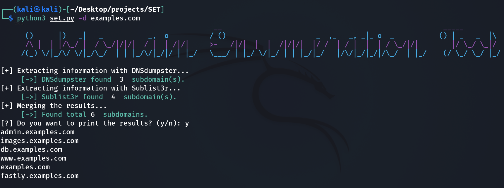
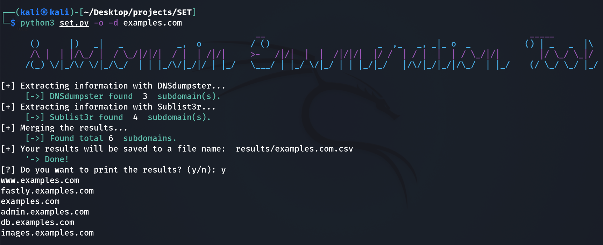

<br />
<p align="center">
    
    <h3 align="center">SET - Subdomain Enumeration Tool</h3>

  <p align="center">
    SET helps enumerate quickly subdomains of a domain by combining the power of DNSdumpster and Sublist3r.
    <br />
  </p>
</p>

## Requirements

* Python >= 3.6
* SET also depends on some python modules: `requests`, `dnspython`, `argparse`, `BeautifulSoup` and `colorama`.

## Installation

```
$ git clone https://github.com/0xb4c/SET.git
$ cd SET
$ pip3 install requirements.txt
```

## How-to-use

* To list all the basic options, use -h:

`python3 set.py -h`

* To enumerate all subdomains of a specific domain, use -d/--domain:

`python3 set.py -d <url>`

* To save results to a csv file, use -o/--output:

`python3 set.py -o -d <url>`


## Examples
* Enumerate  all subdomains of a specific domain



* Enumerate  all subdomains of a specific domain, save results to a csv file



## Acknowledgements
* [DNSdumpster](https://dnsdumpster.com/) is a superb tool that supports discover hosts related to a domain.
* [Sublist3r](https://github.com/aboul3la/Sublist3r) is a perfect tool developed to enumerate subdomains of websites.
